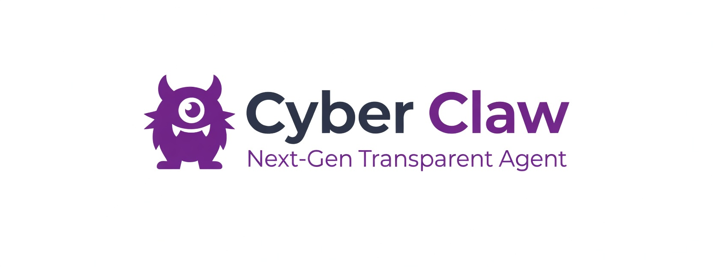

<div align="center">



# LiteClaw

一个让 AI 每一步操作都"留痕"的 Agent 框架

[](https://python.org)
[](https://langchain-ai.github.io/langgraph/)
[](LICENSE)

</div>

## 背景

现在大模型能调用的工具越来越多，但问题也随之而来：AI 偷偷删了文件、执行了危险命令、或者做了个你看不懂的操作——你根本不知道它干了什么。

LiteClaw 想解决的就是这件事。它不是又一个聊天机器人，而是一个**所有行为可审计、危险操作有拦截、长对话不爆 Token**的 Agent 底座。

## 它能做什么

- **会调工具，但不乱来**：文件读写、Shell 执行、定时任务都封装在沙盒里，路径校验 + 危险命令正则拦截 + 超时熔断三层兜底
- **先看说明书再干活**：每个技能分 `help` 和 `run` 两阶段，LLM 先读完整文档评估风险，确认安全后才执行
- **越聊越懂你**：用户偏好写到 Markdown 画像文件，对话历史存 SQLite，超 40 轮自动裁剪旧消息并生成摘要
- **操作全程留痕**：LLM 输入、工具调用、执行结果、AI 回复、系统动作，五类事件全部异步写 JSONL 日志
- **后台定时任务**：独立线程每秒检查任务队列，到点自动触发，重启不丢失

## 快速上手

### 安装

```bash
git clone https://github.com/jygbz/LiteClaw.git
cd LiteClaw
pip install -e .
```

### 配置

```bash
liteclaw config
```

按交互向导选择模型提供商、填入 API Key 即可。也可以手动复制 `.env.example` 为 `.env` 编辑。

支持的提供商：OpenAI / Anthropic / 阿里云 / 腾讯云 / Z.AI / Ollama

### 运行

```bash
# 启动对话
liteclaw run

# 另开一个终端看实时审计日志
liteclaw monitor
```

### 试试这些

| 说什么 | 会发生什么 |
|--------|-----------|
| 现在几点了 | 调用 `get_current_time` 工具 |
| 帮我算 25 乘以 48 | 调用 `calculator` 工具 |
| 每天早 8 点提醒我喝水 | 创建 `daily` 循环任务 |
| 在 office 里创建 test.py | 调用 `write_office_file`（沙盒内） |
| 运行 python test.py | 调用 `execute_office_shell`（60s 超时） |
| 记住我喜欢简洁回答 | 写入 `user_profile.md` 长期画像 |
| /exit | 退出 |

## 架构

```
用户输入 / 心跳任务
        │
        ▼
   ┌─────────────┐
   │  agent_node  │ ◄── 上下文裁剪 + 记忆注入
   └──────┬───────┘
          │
     LLM 决策
          │
    ┌─────┴──────┐
    │ 需要调工具？ │
    └─────┬──────┘
     是   │   否
    ▼     │    ▼
 tools_node   输出回复
    │
    ▼
 返回结果 → 回到 agent_node
```

核心是一个 LangGraph 双节点状态机（`agent` ↔ `tools`），条件路由自动判断 LLM 是否还需要调工具。对话状态通过 `AsyncSqliteSaver` 持久化，关掉重开能接着聊。

### 目录结构

```
LiteClaw/
├── liteclaw/core/
│   ├── agent.py              # LangGraph 状态机，核心循环
│   ├── context.py            # 上下文裁剪 + 记忆管理
│   ├── skill_loader.py       # 懒加载技能引擎（LRU + mtime 热更新）
│   ├── provider.py           # 多模型适配工厂
│   ├── logger.py             # 异步审计日志（单例 + 队列 + 守护线程）
│   ├── heartbeat.py          # 定时任务调度器
│   ├── config.py             # 路径与配置
│   ├── bus.py                # 任务队列
│   └── tools/
│       ├── base.py           # 工具装饰器与基类
│       ├── builtins.py       # 内置工具（时间/计算/任务/画像）
│       └── sandbox_tools.py  # 沙盒工具（文件/Shell）
├── entry/
│   ├── main.py               # 主程序入口
│   ├── cli.py                # CLI 交互层
│   └── monitor.py            # 监控终端
├── tests/                    # 测试套件
├── docs/                     # 文档与截图
└── setup.py
```

## 几个关键设计

### 1. 预检式技能调用（help → run）

技能不是直接执行的。LLM 第一次调用时 `mode='help'`，系统返回完整的 SKILL.md 文档；LLM 读完文档后判断是否安全，确认后才用 `mode='run'` 真正执行。如果发现风险，可以放弃换别的工具。

20 场景对照实验结果：P0 事故率从 50% 降到 10%，代价是平均决策时间多 4.5 秒。

### 2. 分层记忆

- **长期画像**：`workspace/memory/user_profile.md`，纯文本，用户偏好和特殊要求
- **短期记忆**：SQLite 里的完整对话历史
- **裁剪策略**：超过 40 轮时，保留最近轮次，旧消息按完整回合分组压缩为摘要（不会把工具调用和它的结果拆散）

### 3. 纵深防御沙盒

所有文件和 Shell 操作限制在 `workspace/office/` 目录内：

| 层级 | 手段 | 防什么 |
|------|------|--------|
| L1 | 路径规范化 + 前缀校验 | `../` 路径穿越 |
| L2 | 5 条正则熔断规则 | `rm -rf /`、`format`、`del /s` 等 |
| L3 | 60 秒超时 | 死循环 / 长时间占用 |
| L4 | 非交互式执行 | 卡在 `apt install` 等待输入 |

### 4. 异步审计日志

日志写入不阻塞主流程。采用单例 Logger + 内存队列 + 守护线程的模式：主线程往队列里塞事件，后台线程负责写 JSONL 文件。5 类事件全部记录：`llm_input`、`tool_call`、`tool_result`、`ai_message`、`system_action`。

### 5. 懒加载技能引擎

启动时不读全部技能文件，只扫描前 50 行元数据（name + description）。首次调用某个技能时才加载完整 SKILL.md，之后走 LRU 缓存。文件 mtime 变了自动失效重载，改技能不用重启。

## 技能扩展

把技能文件夹放到 `workspace/office/skills/` 下即可，每个技能包含一个 `SKILL.md`：

```markdown
---
name: weather
description: 查询天气预报
---

# 功能
获取城市实时天气

# 命令
curl "wttr.in/Beijing?format=3"
```

支持 Claude Code 和 OpenClaw 两种技能格式，可直接复用现有生态。

## 测试

```bash
# 全量测试
python -m pytest tests/ -v

# 单独跑两阶段对照实验
python tests/test_two_phase_skills.py
```

| 测试 | 覆盖 |
|------|------|
| test_agent.py | Agent 状态机循环 |
| test_builtins.py | 内置工具 |
| test_context_advanced.py | 上下文裁剪 |
| test_sandbox_tools.py | 沙盒安全 |
| test_two_phase_skills.py | 两阶段调用 |
| test_heartbeat.py | 定时任务 |
| test_lazy_loader.py | 懒加载引擎 |
| test_config_and_skill_loader.py | 配置与技能加载 |

## 技术栈

| 依赖 | 用途 |
|------|------|
| LangGraph | 状态机图引擎，驱动 agent ↔ tools 循环 |
| LangChain | LLM 抽象层与工具定义 |
| SQLite (AsyncSqliteSaver) | 对话状态持久化 |
| Prompt Toolkit | 交互式命令行输入 |
| Rich | 终端 UI 与监控面板渲染 |
| Typer | CLI 框架 |
| Pydantic | 数据模型校验 |
| python-dotenv | 环境变量管理 |

## License

MIT
